## 1.1. Сети и маски
Определить и записать в отчёт:
```bash
ipcalc 192.167.38.54/13
```
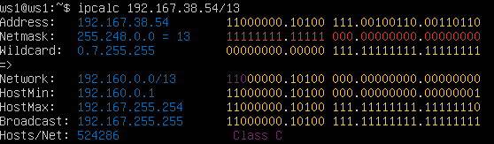
- 192.160.0.0 - адрес


## 1.2. Перевод маски
## 1.1.2.1 Перевод маски *255.255.255.0* в префиксную и двоичную запись

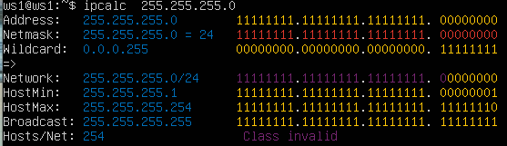
На изображении представлен результат выполнения команды `ipcalc` для маски 255.255.255.0. Здесь показаны:

- **Address:** 255.255.255.0 (IP-адрес)
- **Netmask:** 255.255.255.0, которая в двоичной записи представлена как `11111111.11111111.11111111.00000000`, и это соответствует префиксу `/24`.
- **Network:** 255.255.255.0/24 (сеть)
- **HostMin и HostMax:** диапазон хостов в этой сети, от 255.255.255.1 до 255.255.255.254.
- **Broadcast:** 255.255.255.255 (адрес широковещательной рассылки)
- **Hosts/Net:** 254 хоста могут быть использованы в этой сети.

Этот вывод подтверждает, что маска `255.255.255.0` соответствует префиксу `/24`. 

### После выполнения команды, видим результат, который включает в себя:
- Netmask: 255.255.255.0 = 24 (это и есть префиксная запись)
- Двоичная запись: 11111111.11111111.11111111.00000000


## 1.1.2.2 Перевод маски */15* в обычную и двоичную
    - 255.254.0.0 - обычная
    - 11111111.11111110.00000000.00000000 - двоичная

  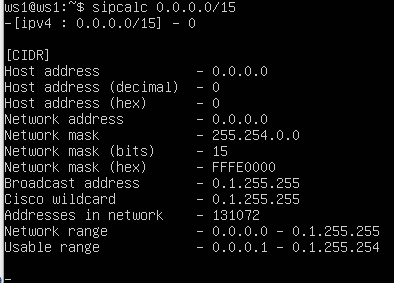
  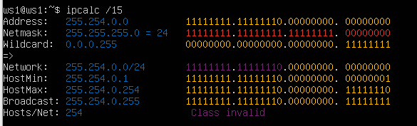
  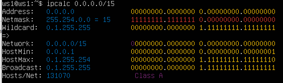
 На скриншоте указана информация, полученная после выполнения команды `ipcalc 0.0.0.0/15`. 

**Что показано на скриншоте:**

1. **Address**: 0.0.0.0 — адрес сети, который был введен для анализа.
2. **Netmask**: 255.254.0.0 = 15 — маска подсети в десятичной записи и в префиксной записи (/15).
3. **Wildcard**: 0.1.255.255 — обратная маска (используется в некоторых сетевых настройках).
4. **Network**: 0.0.0.0/15 — сеть, соответствующая маске /15.
5. **Broadcast**: 0.1.255.255 — широковещательный адрес для данной сети.
6. **HostMin**: 0.0.0.1 — минимальный адрес хоста в этой сети.
7. **HostMax**: 0.1.255.254 — максимальный адрес хоста в этой сети.
8. **Hosts/Net**: 131070 — количество возможных адресов хостов в этой сети.
9. **Dotted Binary Netmask**: 11111111.11111110.00000000.00000000 — маска подсети в двоичном формате.

Этот скриншот показывает, как выглядит маска `/15` в десятичной и двоичной записи:


Обычная запись:
- Это строка, где указана Netmask: 255.254.0.0.

Двоичная запись:

- Это строка, где указана Dotted Binary Netmask: 11111111.11111110.00000000.00000000.


## 1.1.2.3. Перевод маски  11111111.11111111.11111111.11110000 в обычную и префиксную

Можно перевести бинарную маску, как например, `11111111.11111111.11111111.11110000`, в обычную и префиксную маску с помощью терминала, но для этого потребуется несколько шагов.

1. **Для перевода бинарной маски в десятичную (обычную) маску**, можно использовать команду `echo` и утилиту `bc` (или сделать это вручную).

Пример:

```bash
echo "ibase=2; 11111111" | bc
```

Для всей маски нужно будет перевести каждую часть отдельно (первую, вторую, третью и четвертую). Маска будет выглядеть как:

- 11111111 (255)
- 11111111 (255)
- 11111111 (255)
- 11110000 (240)

Можете использовать команду, которая преобразует всю бинарную маску в десятичную:

```bash
echo "ibase=2; 11111111" | bc
echo "ibase=2; 11111111" | bc
echo "ibase=2; 11111111" | bc
echo "ibase=2; 11110000" | bc
```

После этого вы получите результат:

```
255
255
255
240
```

Таким образом, маска в десятичной записи будет: **255.255.255.240**.

2. **Для получения префиксной записи**, достаточно посчитать количество единичных бит в маске.

Бинарная маска `11111111.11111111.11111111.11110000` содержит **28 единичных бит**.

Следовательно, префиксная запись будет `/28`.

Чтобы объединить оба шага и автоматизировать это с помощью командной строки, можно использовать скрипт. Например, так:

```bash
#!/bin/bash
binary_mask="11111111.11111111.11111111.11110000"
octets=($(echo $binary_mask | tr '.' '\n'))  # Разбиваем на части по точкам
for i in "${octets[@]}"; do
  echo $((2#$i))  # Переводим каждую часть в десятичное число
done
```
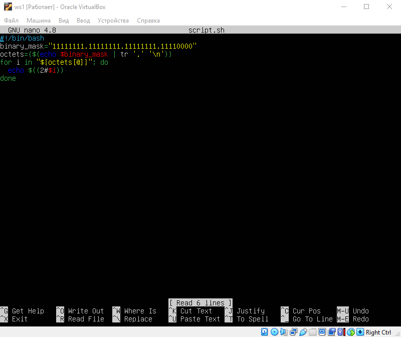

Этот скрипт разделяет маску на октеты, затем переводит каждый октет в десятичную форму.

## Итог:
- **Обычная маска**: `255.255.255.240`
- **Префиксная маска**: `/28`
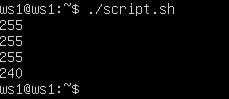


Для перевода двоичной маски `11111111.11111111.11111111.11110000` в обычную десятичную и префиксную запись с помощью команды, также можно воспользоваться утилитой `ipcalc`. Однако, `ipcalc` обычно работает с десятичной записью маски или префиксом, а не с двоичной. Чтобы выполнить это задание вручную, давайте сначала разберёмся, как это сделать:

1. **Перевод в обычную (десятичную) запись:**
   - `11111111` в двоичной — это `255` в десятичной.
   - `11111111` в двоичной — это `255` в десятичной.
   - `11111111` в двоичной — это `255` в десятичной.
   - `11110000` в двоичной — это `240` в десятичной.

   Итак, маска `11111111.11111111.11111111.11110000` соответствует `255.255.255.240`.

2. **Перевод в префиксную запись:**
   - Подсчитываем количество единиц в двоичной маске: `28` единиц.
   Префиксная запись будет `/28`.


Теперь, как можно сделать это с помощью `ipcalc`:
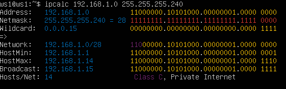

1. **Определение маски:**

   Мы можем использовать `ipcalc` для вычисления сети с маской `/28` и она покажет нам десятичную маску:

   ```bash
   ipcalc 192.168.0.0/28
   ```

   Эта команда покажет нам маску `255.255.255.240`.

2. **Преобразование двоичной маски вручную:**

   Если нужно просто получить результат:

   - Обычная запись: `255.255.255.240`
   - Префикс: `/28`

Нет команды, которая бы напрямую приняла двоичную маску и вернула десятичную и префиксную записи. Нужно сначала перевести маску вручную или использовать десятичный формат для ввода в `ipcalc`.


## 1.1.3.1. Определил и записал в отчёт минимальный и максимальный хост в сети *12.167.38.4* при масках:

## 1.3.1 */8*, команда - ipcalc 12.167.38.4/8
  - 12.0.0.1 - min
  - 12.255.255.254 - max

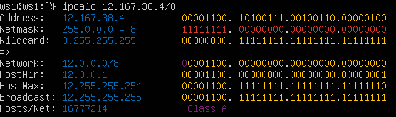


## 1.1.3.2 Определил и записал в отчёт минимальный и максимальный хост в сети при маске 11111111.11111111.00000000.00000000 (что эквивалентно 255.255.0.0 или 16  )

## команда - ipcalc 12.167.38.4    255.255.0.0

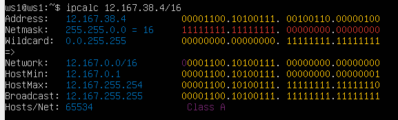

## Минимальный и максимальный хосты:
- **Минимальный хост:** `12.167.0.1`
- **Максимальный хост:** `12.167.255.254`


## 1.1.3.3 Определил и записал в отчёт минимальный и максимальный хост в сети при маске  /4:

## команда - ipcalc 12.167.38.4/4


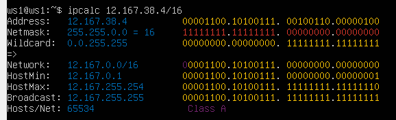
- */4*
  - 0.0.0.1 - min
  - 15.255.255.254 - max


## 1.2. localhost.

## 1.2.1.1. localhost. Определить и записать в отчёт, можно ли обратиться к приложению, работающему на localhost, со следующими IP:

> Адреса на localhost должны находиться в диапазоне 127.0.0.1 - 127.255.255.254

`localhost` — это специальный зарезервированный IP-адрес, который всегда указывает на текущую машину. Обычно, этот адрес представлен как `127.0.0.1` и относится к сети `127.0.0.0/8`. Все IP-адреса в диапазоне `127.x.x.x` предназначены для "обратной связи", т.е., для связи самой системы с собой.

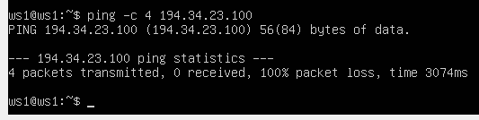

1. *194.34.23.100* -  нельзя. Это публичный IP-адрес, который также не входит в диапазон `127.0.0.0/8`. Он может принадлежать любому устройству в интернете, но не моему компьютеру в рамках `localhost`.


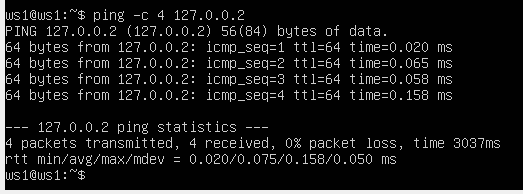

2. *127.0.0.2* - можно


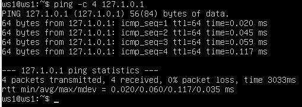

3. *127.1.0.1* - можно


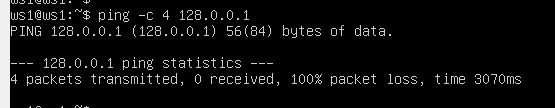

4. *128.0.0.1* - нельзя. Этот адрес не входит в диапазон `127.0.0.0/8`. Он принадлежит другой сети. Например, `128.0.0.0/8` — это другая сеть, где маска подсети также `255.0.0.0`, но первый октет адреса — `128`, а не `127`.


## 1.3. Диапазоны и сегменты сетей
## Определи и запиши в отчёт:

## 1) Какие из перечисленных IP можно использовать в качестве публичного, а какие только в качестве частных: 10.0.0.45, 134.43.0.2, 192.168.4.2, 172.20.250.4, 172.0.2.1, 192.172.0.1, 172.68.0.2, 172.16.255.255, 10.10.10.10, 192.169.168.1

`ЗДЕСЬ Я  ПОМЕНЯЛ ПОЛЬЗОВАТЕЛЯ ТАК КАК ВЫНУЖДЕН БЫЛ ВЫПОЛНЯТЬ ЗАДАНИЯ НА ПК РАБОТОДАТЕЛЯ А НЕ НА ДОМАШНЕМ ПК, ПОЭТОМУ ПОЛЬЗОВАТЕЛЬ ДРУГОЙ`

- 10.0.0.45 — частный <br>
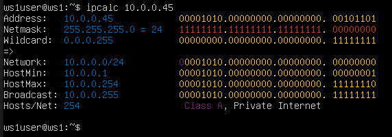


- 134.43.0.2 — публичный <br>
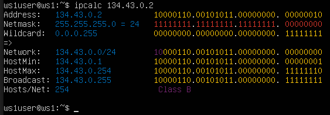
   
- 192.168.4.2 — частный <br>
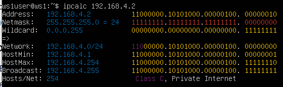

- 172.20.250.4 — частный <br>
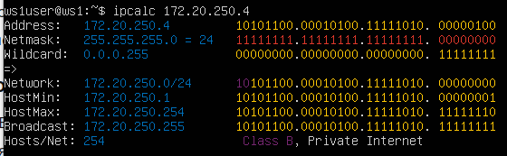

- 172.0.2.1 — публичный <br>
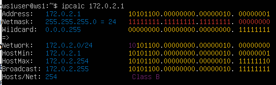
  
- 192.172.0.1 — публичный <br>
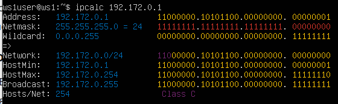

- 172.68.0.2 — публичный <br>
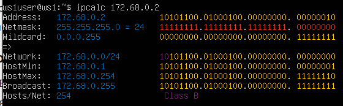
   
- 172.16.255.255 — частный <br>
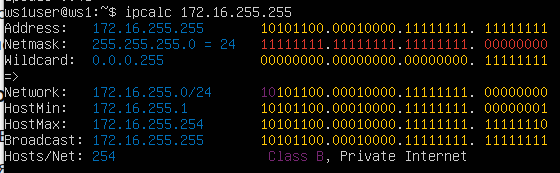

- 10.10.10.10 — частный <br>
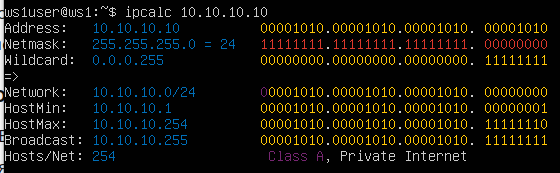
  
- 192.169.168.1 — публичный <br>
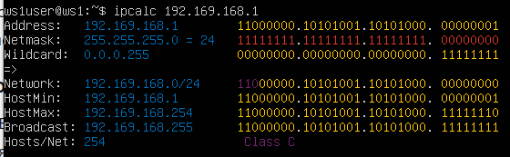


## 2)  Какие из перечисленных IP-адресов шлюза возможны у сети 10.10.0.0/18: 10.0.0.1, 10.10.0.2, 10.10.10.10, 10.10.100.1, 10.10.1.255

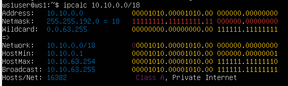

Да, на основании вывода команды `ipcalc 10.10.0.0/18` можно точно определить, какие IP-адреса возможны для этой сети.


1. **10.0.0.1** — это вне диапазона (до **10.10.0.0**), так как сеть 10.10.0.0/18 начинается с **10.10.0.0**.
2. **10.10.0.2** — внутри диапазона (между **10.10.0.1** и **10.10.63.254**), это допустимый IP-адрес.
3. **10.10.10.10** — внутри диапазона (между **10.10.0.1** и **10.10.63.254**), это допустимый IP-адрес.
4. **10.10.100.1** — это вне диапазона (сеть заканчивается на **10.10.63.255**).
5. **10.10.1.255** — это внутри диапазона, но является широковещательным адресом для сети 10.10.1.0/24, а не для 10.10.0.0/18, поэтому его нельзя использовать как адрес для хоста в данной сети.


## Part 2. Статическая маршрутизация между двумя машинами

- Поднять две виртуальные машины (далее -- ws1 и ws2)

> 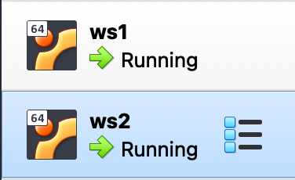


- С помощью команды ip a посмотрел существующие сетевые интерфейсы. В отчёт поместил скрин с вызовом и выводом использованной команды.

- ws1
  > 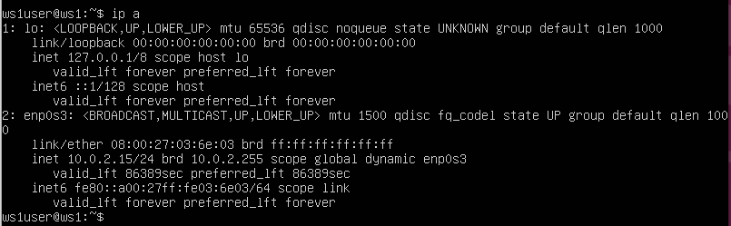
- ws2
  >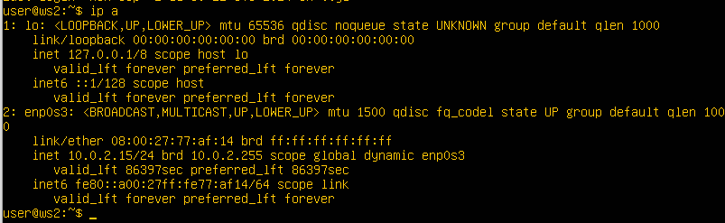


> - Настраиваем локальное соединение на обеих машинах через VirtualBox.
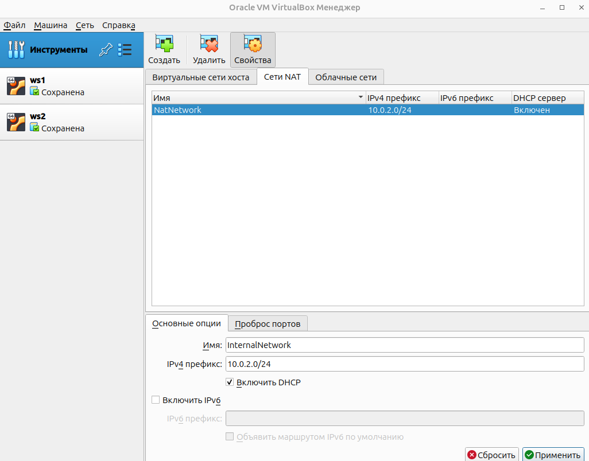

На скриншоте показано окно настройки сети в программе VirtualBox, находящееся в разделе "Сети NAT". В этом разделе отсутствуют созданные сети NAT, что означает, что ни одна из виртуальных машин в данный момент не подключена к сети NAT. На панели слева видны две виртуальные машины — ws1 и ws2, которые находятся в сохраненном состоянии.


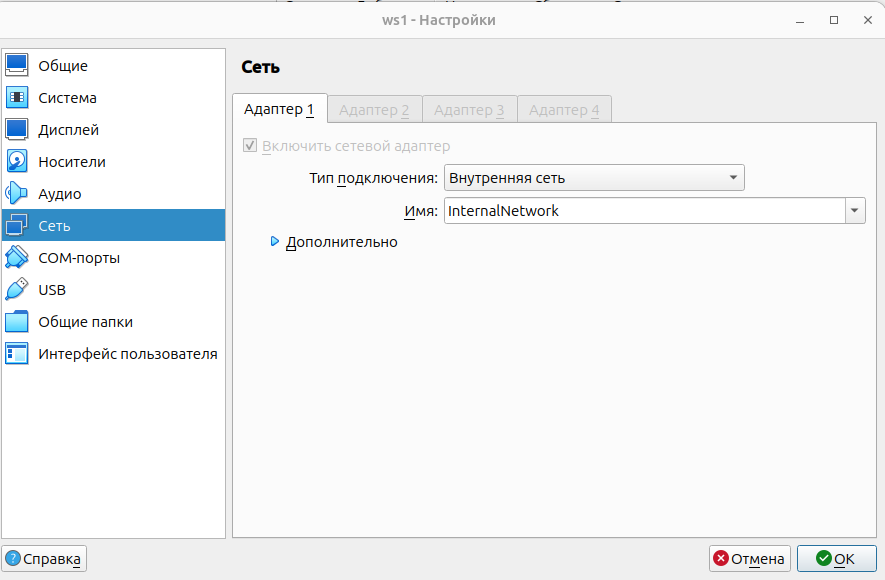
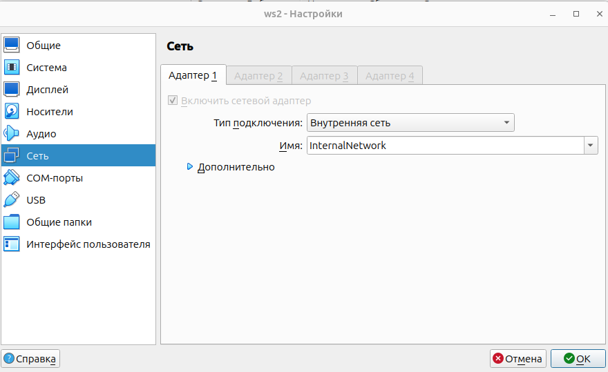


На скриншоте показаны настройки сети для виртуальной машины ws2  и ws1 в Oracle VM VirtualBox. Настройка произведена во вкладке "Сеть" в параметрах виртуальной машины. Здесь видно, что Адаптер 1 подключен и настроен на использование типа подключения "Внутренняя сеть" (Internal Network). Также указано имя сети "InternalNetwork", что обеспечивает соединение данной виртуальной машины с другими виртуальными машинами, подключенными к той же внутренней сети.

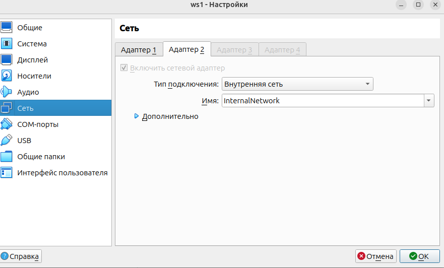
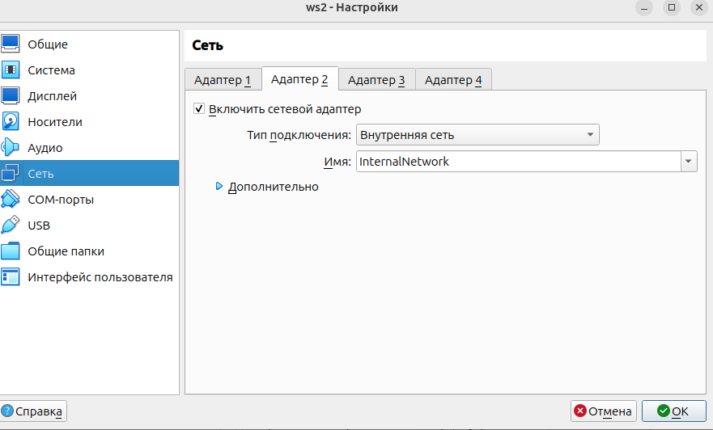


## Описание скриншотов:

На предоставленных скриншотах показаны настройки сетевого адаптера двух виртуальных машин (WS1 и WS2) в VirtualBox.

## Скриншот 1 (WS1):
На скриншоте отображена вкладка "Сеть" в настройках виртуальной машины WS1. 
- **Адаптер 2** активирован и настроен на использование **Внутренней сети** с именем **InternalNetwork**.
- Важно: это позволяет виртуальным машинам WS1 и WS2 взаимодействовать друг с другом, используя внутреннюю сеть, изолированную от внешнего интернета.

## Скриншот 2 (WS2):
На скриншоте показаны аналогичные настройки для виртуальной машины WS2. 
- **Адаптер 2** также активирован и настроен на использование **Внутренней сети** с именем **InternalNetwork**, что позволяет обеим виртуальным машинам обмениваться данными друг с другом внутри этой внутренней сети.

## Цель:

Открыл настройки сети виртуальных машин WS1 и WS2 в VirtualBox для того, чтобы убедиться, что обе машины подключены к одной и той же внутренней сети. Это необходимо для выполнения задания по настройке статической маршрутизации между двумя виртуальными машинами. Подключение через внутреннюю сеть обеспечит связь между WS1 и WS2, что является основой для последующей настройки маршрутизации и обмена данными между этими машинами без использования внешних сетей, таких как интернет.

Настройки внутренней сети с именем **InternalNetwork** позволяют WS1 и WS2 взаимодействовать друг с другом напрямую, что необходимо для выполнения учебного задания по статической маршрутизации.


- Описать сетевой интерфейс, соответствующий внутренней сети, на обеих машинах и задать следующие адреса и маски: ws1 - *192.168.100.10*, маска */16*, ws2 - *172.24.116.8*, маска */12*
- В отчёт поместить скрины с содержанием изменённого файла *etc/netplan/00-installer-config.yaml* для каждой машины. 
- ws1 <br>
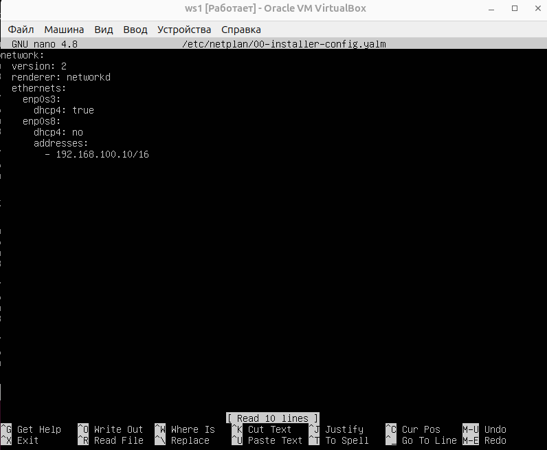
- ws2 <br>
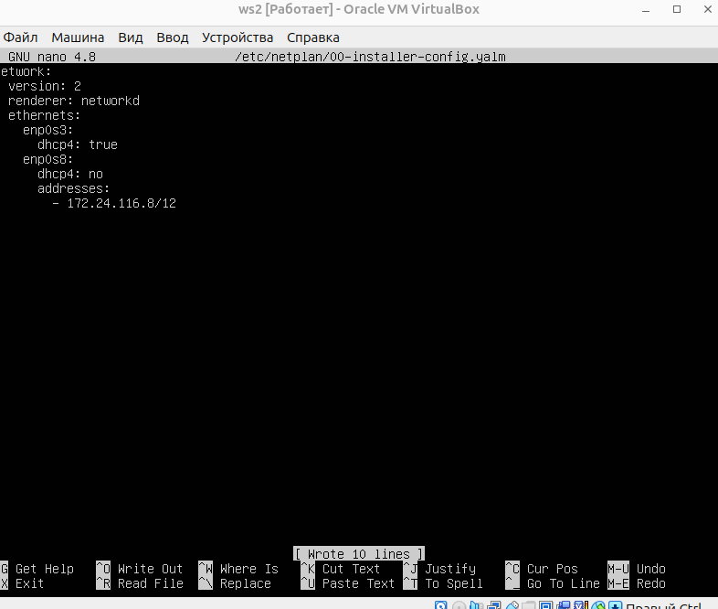


-Выполнить команду `netplan apply` для перезапуска сервиса сети. В отчёт поместить скрин с вызовом и выводом использованной команды.

- ws1 <br>
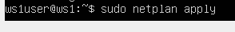
- ws2 <br>


## Описание скриншотов и цели

**Цель:**
Настроить статические IP-адреса для сетевых интерфейсов `enp0s8` на двух виртуальных машинах (`ws1` и `ws2`) для создания сети между ними. Эти настройки необходимы для дальнейшего добавления статических маршрутов и проверки соединения между машинами.

**Скриншот 1 (ws2):**

На скриншоте показан файл `/etc/netplan/00-installer-config.yaml` на машине `ws2`. В этом файле настроен сетевой интерфейс `enp0s8` с использованием статического IP-адреса `172.24.116.8` с маской подсети `/12`.

**Скриншот 2 (ws1):**

На скриншоте показан файл `/etc/netplan/00-installer-config.yaml` на машине `ws1`. В этом файле настроен сетевой интерфейс `enp0s8` с использованием статического IP-адреса `192.168.100.10` с маской подсети `/16`.

## Команды, используемые для выполнения задачи:

1. **Открытие и редактирование файла конфигурации сетевого интерфейса:**

   Для машины `ws2`:
   ```bash
   sudo nano /etc/netplan/00-installer-config.yaml
   ```

   Для машины `ws1`:
   ```bash
   sudo nano /etc/netplan/00-installer-config.yaml
   ```

2. **Сохранение изменений в файле и применение настроек сети:**

   После редактирования файла конфигурации, сохранены изменения и закрыт редактор (в `nano` это делается нажатием `Ctrl+S`, затем `Enter` для сохранения, и `Ctrl+X` для выхода).

3. **Применение новых сетевых настроек:**

   На обеих машинах выполнена команда:
   ```bash
   sudo netplan apply
   ```


- ws1 <br>
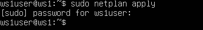
- ws2 <br>


## 2.1. Добавление статического маршрута вручную

 1. Добавь статический маршрут от одной машины до другой и обратно при помощи команды вида ip r add.


 2.  В отчёт помести скрин с вызовом и выводом использованных команд.
- ws1 <br>
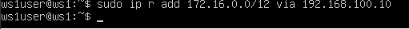
- ws2 <br>
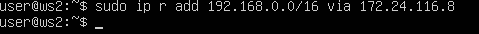


При добавлении статического маршрута необходимо указывать именно сетевой адрес, а не адрес конкретного узла. Вот подробное объяснение для отчёта:

1. **Сетевая адресация по маске /16:**
   - При маске /16 сеть охватывает адреса от 192.168.0.0 до 192.168.255.255.
   - Сетевой адрес – это первый адрес диапазона (в данном случае 192.168.0.0), который служит идентификатором всей сети.

2. **Назначение статического маршрута:**
   - Статический маршрут используется для указания системы, что весь трафик, направленный в определённую сеть, должен отправляться через заданный шлюз.
   - Команда `sudo ip route add 192.168.0.0/16 via 172.24.116.8` сообщает системе, что для доступа к любому узлу в сети 192.168.0.0/16 (то есть для всех адресов от 192.168.0.0 до 192.168.255.255) нужно использовать шлюз 172.24.116.8.

3. **Почему не 192.168.100.10/16:**
   - Адрес 192.168.100.10 является адресом конкретного хоста, а не сетевым адресом.
   - Если указать 192.168.100.10/16, система будет ожидать, что 192.168.100.10 – это начало диапазона сети, что неверно, так как для сети с маской /16 корректным сетевым адресом является 192.168.0.0.
   - Таким образом, использование адреса 192.168.100.10/16 приведёт к ошибке, так как он не соответствует правильному сетевому адресу для заданной маски.

**Вывод:**  
Для корректной маршрутизации необходимо указать сетевой адрес 192.168.0.0/16, чтобы охватить всю сеть, а не отдельный адрес узла. Это гарантирует, что трафик для любого устройства в сети будет направлен через нужный шлюз (в данном случае через 172.24.116.8).


 3. Пропингуй соединение между машинами.
- ws1 <br>
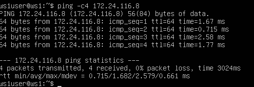
- ws2 <br>
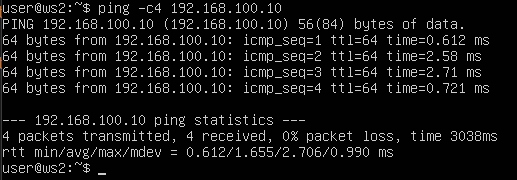


## 2.2. Добавление статического маршрута с сохранением

1. Перезапусти машины.

2. Добавь статический маршрут от одной машины до другой с помощью файла /etc/netplan/00-installer-config.yaml.

3. В отчёт помести скрин с содержанием изменённого файла /etc/netplan/00-installer-config.yaml.
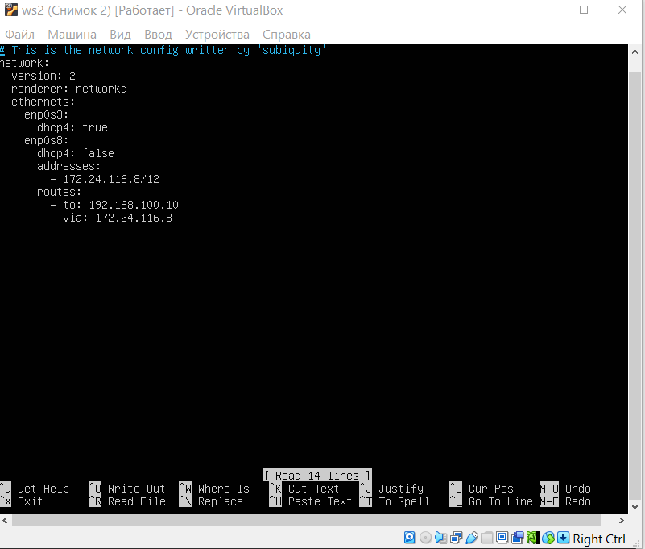
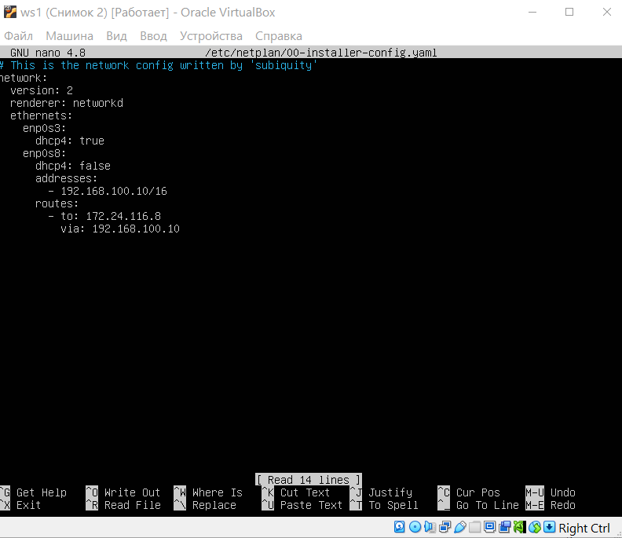


4. Пропингуй соединение между машинами.

5. В отчёт помести скрин с вызовом и выводом использованной команды.
- ws1 <br>
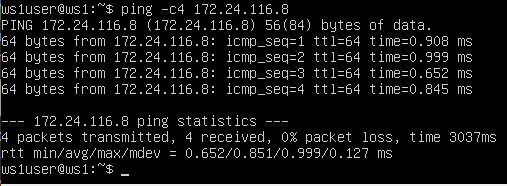
- ws2 <br>
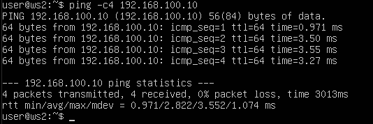


## Part 3. Утилита iperf3
## **3.1. Перевод единиц скорости**

1. **8 Mbps** в **MB/s**  **= 1 MB/s**
2. **100 MB/s** в **Kbps**  **= 800000 Kbps**
3. **1 Gbps** в **Mbps**  **= 1000 Mbps**
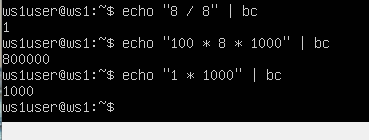

---

## **3.2. Измерение скорости с iperf3**

## **1. Установка iperf3 (если не установлен)**
На обеих виртуальных машинах `ws1` и `ws2` установи утилиту iperf3:
```bash
sudo apt update && sudo apt install -y iperf3
```


- В отчёт поместить скрины с вызовом и выводом использованных команд.
>
> - ws1
>
>   `iperf -s`
> 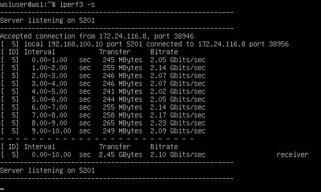
> - ws2
>
>   `iperf -c 192.168.100.10`
> 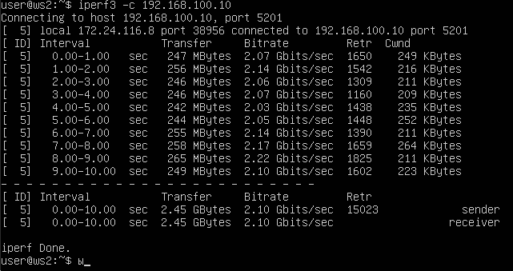


## 4.1. Утилита iptables


Создай файл /etc/firewall.sh, имитирующий файрвол, на ws1 и ws2:

#!/bin/sh

# Удаление всех правил в таблице «filter» (по умолчанию).
iptables -F
iptables -X


Нужно добавить в файл подряд следующие правила:

1) На ws1 примени стратегию, когда в начале пишется запрещающее правило, а в конце пишется разрешающее правило (это касается пунктов 4 и 5).

2) На ws2 примени стратегию, когда в начале пишется разрешающее правило, а в конце пишется запрещающее правило (это касается пунктов 4 и 5).

3) Открой на машинах доступ для порта 22 (ssh) и порта 80 (http).

4) Запрети echo reply (машина не должна «пинговаться», т. е. должна быть блокировка на OUTPUT).

5) Разреши echo reply (машина должна «пинговаться»).

В отчёт помести скрины с содержанием файла /etc/firewall для каждой машины.


> 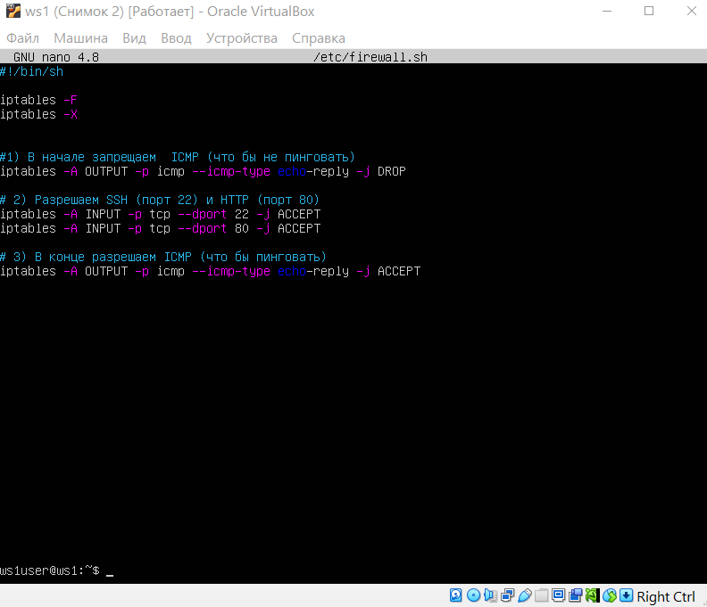

> 


---

Запусти файлы на обеих машинах командами chmod +x /etc/firewall.sh и /etc/firewall.sh.

> 

> 

В отчёт помести скрины с запуском обоих файлов.
В отчёте опиши разницу между стратегиями, применёнными в первом и втором файлах.


> 

> 


## **Разница между стратегиями**
- **ws1**: сначала запрещаем ICMP, потом разрешаем (в итоге ICMP **разрешён**).  
- **ws2**: сначала разрешаем ICMP, потом запрещаем (в итоге ICMP **запрещён**).  

Таким образом, **ws1 пингуется, а ws2 нет**.


## 4.2. Утилита nmap


 - Командой ping найди машину, которая не «пингуется», после чего утилитой nmap покажи, что хост машины запущен.
Проверка: в выводе nmap должно быть сказано: Host is up.
> 

 - В отчёт помести скрины с вызовом и выводом использованных команд ping и nmap.


- ws1
> 
- ws2
> 


