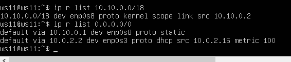
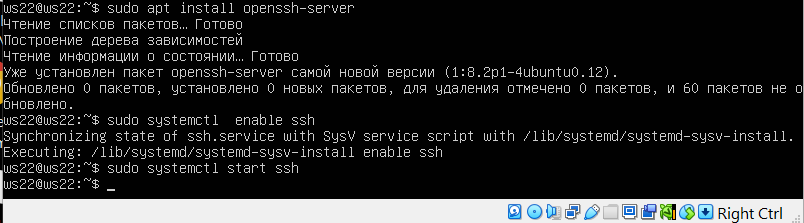
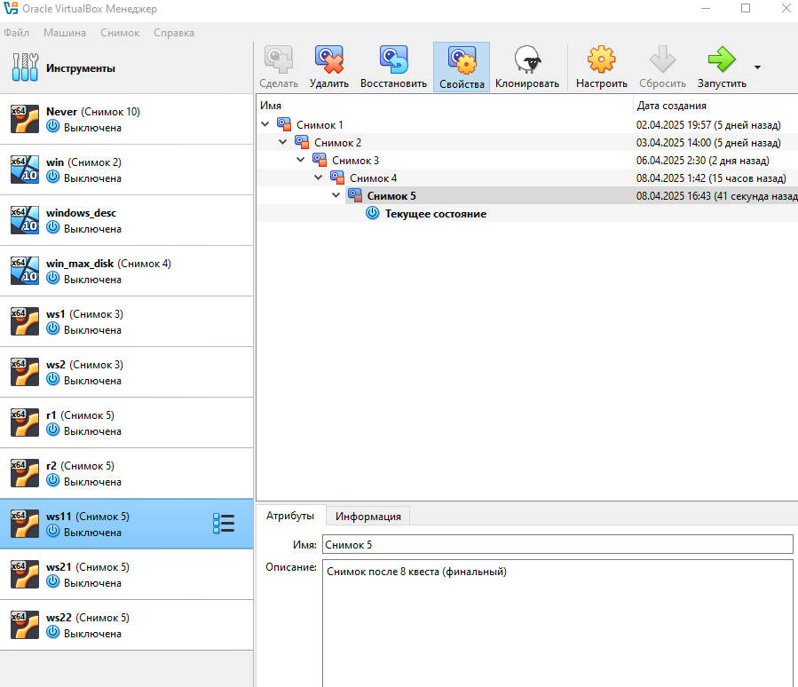

## 1.1. Сети и маски
Определить и записать в отчёт:
```bash
ipcalc 192.167.38.54/13
```

- 192.160.0.0 - адрес


## 1.2. Перевод маски
## 1.1.2.1 Перевод маски *255.255.255.0* в префиксную и двоичную запись


На изображении представлен результат выполнения команды `ipcalc` для маски 255.255.255.0. Здесь показаны:

- **Address:** 255.255.255.0 (IP-адрес)
- **Netmask:** 255.255.255.0, которая в двоичной записи представлена как `11111111.11111111.11111111.00000000`, и это соответствует префиксу `/24`.
- **Network:** 255.255.255.0/24 (сеть)
- **HostMin и HostMax:** диапазон хостов в этой сети, от 255.255.255.1 до 255.255.255.254.
- **Broadcast:** 255.255.255.255 (адрес широковещательной рассылки)
- **Hosts/Net:** 254 хоста могут быть использованы в этой сети.

Этот вывод подтверждает, что маска `255.255.255.0` соответствует префиксу `/24`. 

**После выполнения команды, видим результат, который включает в себя:**
- Netmask: 255.255.255.0 = 24 (это и есть префиксная запись)
- Двоичная запись: 11111111.11111111.11111111.00000000


## 1.1.2.2 Перевод маски */15* в обычную и двоичную
    - 255.254.0.0 - обычная
    - 11111111.11111110.00000000.00000000 - двоичная

  - 
  
  - 

  - 
 На скриншоте указана информация, полученная после выполнения команды `ipcalc 0.0.0.0/15`. 

**Что показано на скриншоте:**

1. **Address**: 0.0.0.0 — адрес сети, который был введен для анализа.
2. **Netmask**: 255.254.0.0 = 15 — маска подсети в десятичной записи и в префиксной записи (/15).
3. **Wildcard**: 0.1.255.255 — обратная маска (используется в некоторых сетевых настройках).
4. **Network**: 0.0.0.0/15 — сеть, соответствующая маске /15.
5. **Broadcast**: 0.1.255.255 — широковещательный адрес для данной сети.
6. **HostMin**: 0.0.0.1 — минимальный адрес хоста в этой сети.
7. **HostMax**: 0.1.255.254 — максимальный адрес хоста в этой сети.
8. **Hosts/Net**: 131070 — количество возможных адресов хостов в этой сети.
9. **Dotted Binary Netmask**: 11111111.11111110.00000000.00000000 — маска подсети в двоичном формате.

Этот скриншот показывает, как выглядит маска `/15` в десятичной и двоичной записи:


Обычная запись:
- Это строка, где указана Netmask: 255.254.0.0.

Двоичная запись:

- Это строка, где указана Dotted Binary Netmask: 11111111.11111110.00000000.00000000.


## 1.1.2.3. Перевод маски  11111111.11111111.11111111.11110000 в обычную и префиксную

Можно перевести бинарную маску, как например, `11111111.11111111.11111111.11110000`, в обычную и префиксную маску с помощью терминала, но для этого потребуется несколько шагов.

1. **Для перевода бинарной маски в десятичную (обычную) маску**, можно использовать команду `echo` и утилиту `bc` (или сделать это вручную).

Пример:

```bash
echo "ibase=2; 11111111" | bc
```

Для всей маски нужно будет перевести каждую часть отдельно (первую, вторую, третью и четвертую). Маска будет выглядеть как:

- 11111111 (255)
- 11111111 (255)
- 11111111 (255)
- 11110000 (240)

Можете использовать команду, которая преобразует всю бинарную маску в десятичную:

```bash
echo "ibase=2; 11111111" | bc
echo "ibase=2; 11111111" | bc
echo "ibase=2; 11111111" | bc
echo "ibase=2; 11110000" | bc
```

После этого вы получите результат:

```
255
255
255
240
```

Таким образом, маска в десятичной записи будет: **255.255.255.240**.

2. **Для получения префиксной записи**, достаточно посчитать количество единичных бит в маске.

Бинарная маска `11111111.11111111.11111111.11110000` содержит **28 единичных бит**.

Следовательно, префиксная запись будет `/28`.

Чтобы объединить оба шага и автоматизировать это с помощью командной строки, можно использовать скрипт. Например, так:

```bash
#!/bin/bash
binary_mask="11111111.11111111.11111111.11110000"
octets=($(echo $binary_mask | tr '.' '\n'))  # Разбиваем на части по точкам
for i in "${octets[@]}"; do
  echo $((2#$i))  # Переводим каждую часть в десятичное число
done
```


Этот скрипт разделяет маску на октеты, затем переводит каждый октет в десятичную форму.

## Итог:
- **Обычная маска**: `255.255.255.240`
- **Префиксная маска**: `/28`

- 


Для перевода двоичной маски `11111111.11111111.11111111.11110000` в обычную десятичную и префиксную запись с помощью команды, также можно воспользоваться утилитой `ipcalc`. Однако, `ipcalc` обычно работает с десятичной записью маски или префиксом, а не с двоичной. Чтобы выполнить это задание вручную, давайте сначала разберёмся, как это сделать:

1. **Перевод в обычную (десятичную) запись:**
   - `11111111` в двоичной — это `255` в десятичной.
   - `11111111` в двоичной — это `255` в десятичной.
   - `11111111` в двоичной — это `255` в десятичной.
   - `11110000` в двоичной — это `240` в десятичной.

   Итак, маска `11111111.11111111.11111111.11110000` соответствует `255.255.255.240`.

2. **Перевод в префиксную запись:**
   - Подсчитываем количество единиц в двоичной маске: `28` единиц.
   Префиксная запись будет `/28`.


Теперь, как можно сделать это с помощью `ipcalc`:

- 

1. **Определение маски:**

   Мы можем использовать `ipcalc` для вычисления сети с маской `/28` и она покажет нам десятичную маску:

   ```bash
   ipcalc 192.168.0.0/28
   ```

   Эта команда покажет нам маску `255.255.255.240`.

2. **Преобразование двоичной маски вручную:**

   Если нужно просто получить результат:

   - Обычная запись: `255.255.255.240`
   - Префикс: `/28`

Нет команды, которая бы напрямую приняла двоичную маску и вернула десятичную и префиксную записи. Нужно сначала перевести маску вручную или использовать десятичный формат для ввода в `ipcalc`.


## 1.1.3.1. Определил и записал в отчёт минимальный и максимальный хост в сети *12.167.38.4* при масках:

**1.3.1 */8*, команда - ipcalc 12.167.38.4/8**
  - 12.0.0.1 - min
  - 12.255.255.254 - max


## 1.1.3.2 Определил и записал в отчёт минимальный и максимальный хост в сети при маске 11111111.11111111.00000000.00000000 (что эквивалентно 255.255.0.0 или 16  )

**команда - ipcalc 12.167.38.4    255.255.0.0**


**Минимальный и максимальный хосты:**
- **Минимальный хост:** `12.167.0.1`
- **Максимальный хост:** `12.167.255.254`

## 1.1.3.3 Определил и записал в отчёт минимальный и максимальный хост в сети при маске - 255.255.254.0:


## 1.1.3.4 Определил и записал в отчёт минимальный и максимальный хост в сети при маске  /4:

**команда - ipcalc 12.167.38.4/4**


- */4*
  - 0.0.0.1 - min
  - 15.255.255.254 - max


## 1.2. localhost.

## 1.2.1.1. localhost. Определить и записать в отчёт, можно ли обратиться к приложению, работающему на localhost, со следующими IP:

> Адреса на localhost должны находиться в диапазоне 127.0.0.1 - 127.255.255.254

`localhost` — это специальный зарезервированный IP-адрес, который всегда указывает на текущую машину. Обычно, этот адрес представлен как `127.0.0.1` и относится к сети `127.0.0.0/8`. Все IP-адреса в диапазоне `127.x.x.x` предназначены для "обратной связи", т.е., для связи самой системы с собой.


1. *194.34.23.100* -  нельзя. Это публичный IP-адрес, который также не входит в диапазон `127.0.0.0/8`. Он может принадлежать любому устройству в интернете, но не моему компьютеру в рамках `localhost`.


2. *127.0.0.2* - можно


3. *127.1.0.1* - можно


4. *128.0.0.1* - нельзя. Этот адрес не входит в диапазон `127.0.0.0/8`. Он принадлежит другой сети. Например, `128.0.0.0/8` — это другая сеть, где маска подсети также `255.0.0.0`, но первый октет адреса — `128`, а не `127`.


## 1.3. Диапазоны и сегменты сетей
## Определи и запиши в отчёт:

## 1) Какие из перечисленных IP можно использовать в качестве публичного, а какие только в качестве частных: 10.0.0.45, 134.43.0.2, 192.168.4.2, 172.20.250.4, 172.0.2.1, 192.172.0.1, 172.68.0.2, 172.16.255.255, 10.10.10.10, 192.169.168.1

`ЗДЕСЬ Я  ПОМЕНЯЛ ПОЛЬЗОВАТЕЛЯ ТАК КАК ВЫНУЖДЕН БЫЛ ВЫПОЛНЯТЬ ЗАДАНИЯ НА ПК РАБОТОДАТЕЛЯ А НЕ НА ДОМАШНЕМ ПК, ПОЭТОМУ ПОЛЬЗОВАТЕЛЬ ДРУГОЙ`

- 10.0.0.45 — частный <br>


- 134.43.0.2 — публичный <br>

   
- 192.168.4.2 — частный <br>


- 172.20.250.4 — частный <br>


- 172.0.2.1 — публичный <br>

  
- 192.172.0.1 — публичный <br>


- 172.68.0.2 — публичный <br>

   
- 172.16.255.255 — частный <br>


- 10.10.10.10 — частный <br>

  
- 192.169.168.1 — публичный <br>


## 2)  Какие из перечисленных IP-адресов шлюза возможны у сети 10.10.0.0/18: 10.0.0.1, 10.10.0.2, 10.10.10.10, 10.10.100.1, 10.10.1.255


Да, на основании вывода команды `ipcalc 10.10.0.0/18` можно точно определить, какие IP-адреса возможны для этой сети.


1. **10.0.0.1** — это вне диапазона (до **10.10.0.0**), так как сеть 10.10.0.0/18 начинается с **10.10.0.0**.
2. **10.10.0.2** — внутри диапазона (между **10.10.0.1** и **10.10.63.254**), это допустимый IP-адрес.
3. **10.10.10.10** — внутри диапазона (между **10.10.0.1** и **10.10.63.254**), это допустимый IP-адрес.
4. **10.10.100.1** — это вне диапазона (сеть заканчивается на **10.10.63.255**).
5. **10.10.1.255** — это внутри диапазона, но является широковещательным адресом для сети 10.10.1.0/24, а не для 10.10.0.0/18, поэтому его нельзя использовать как адрес для хоста в данной сети.


## Part 2. Статическая маршрутизация между двумя машинами

- Поднять две виртуальные машины (далее -- ws1 и ws2)

> 


- С помощью команды ip a посмотрел существующие сетевые интерфейсы. В отчёт поместил скрин с вызовом и выводом использованной команды.

- ws1
  > 
- ws2
  >


> - Настраиваем локальное соединение на обеих машинах через VirtualBox.


На скриншоте показано окно настройки сети в программе VirtualBox, находящееся в разделе "Сети NAT". В этом разделе отсутствуют созданные сети NAT, что означает, что ни одна из виртуальных машин в данный момент не подключена к сети NAT. На панели слева видны две виртуальные машины — ws1 и ws2, которые находятся в сохраненном состоянии.


На скриншоте показаны настройки сети для виртуальной машины ws2  и ws1 в Oracle VM VirtualBox. Настройка произведена во вкладке "Сеть" в параметрах виртуальной машины. Здесь видно, что Адаптер 1 подключен и настроен на использование типа подключения "Внутренняя сеть" (Internal Network). Также указано имя сети "InternalNetwork", что обеспечивает соединение данной виртуальной машины с другими виртуальными машинами, подключенными к той же внутренней сети.


## Описание скриншотов:

На предоставленных скриншотах показаны настройки сетевого адаптера двух виртуальных машин (WS1 и WS2) в VirtualBox.

## Скриншот 1 (WS1):
На скриншоте отображена вкладка "Сеть" в настройках виртуальной машины WS1. 
- **Адаптер 2** активирован и настроен на использование **Внутренней сети** с именем **InternalNetwork**.
- Важно: это позволяет виртуальным машинам WS1 и WS2 взаимодействовать друг с другом, используя внутреннюю сеть, изолированную от внешнего интернета.

## Скриншот 2 (WS2):
На скриншоте показаны аналогичные настройки для виртуальной машины WS2. 
- **Адаптер 2** также активирован и настроен на использование **Внутренней сети** с именем **InternalNetwork**, что позволяет обеим виртуальным машинам обмениваться данными друг с другом внутри этой внутренней сети.

## Цель:

Открыл настройки сети виртуальных машин WS1 и WS2 в VirtualBox для того, чтобы убедиться, что обе машины подключены к одной и той же внутренней сети. Это необходимо для выполнения задания по настройке статической маршрутизации между двумя виртуальными машинами. Подключение через внутреннюю сеть обеспечит связь между WS1 и WS2, что является основой для последующей настройки маршрутизации и обмена данными между этими машинами без использования внешних сетей, таких как интернет.

Настройки внутренней сети с именем **InternalNetwork** позволяют WS1 и WS2 взаимодействовать друг с другом напрямую, что необходимо для выполнения учебного задания по статической маршрутизации.


- Описать сетевой интерфейс, соответствующий внутренней сети, на обеих машинах и задать следующие адреса и маски: ws1 - *192.168.100.10*, маска */16*, ws2 - *172.24.116.8*, маска */12*
- В отчёт поместить скрины с содержанием изменённого файла *etc/netplan/00-installer-config.yaml* для каждой машины. 
- ws1 <br>

- ws2 <br>


-Выполнить команду `netplan apply` для перезапуска сервиса сети. В отчёт поместить скрин с вызовом и выводом использованной команды.

- ws1 <br>

- ws2 <br>


## Описание скриншотов и цели

**Цель:**
Настроить статические IP-адреса для сетевых интерфейсов `enp0s8` на двух виртуальных машинах (`ws1` и `ws2`) для создания сети между ними. Эти настройки необходимы для дальнейшего добавления статических маршрутов и проверки соединения между машинами.

**Скриншот 1 (ws2):**

На скриншоте показан файл `/etc/netplan/00-installer-config.yaml` на машине `ws2`. В этом файле настроен сетевой интерфейс `enp0s8` с использованием статического IP-адреса `172.24.116.8` с маской подсети `/12`.

**Скриншот 2 (ws1):**

На скриншоте показан файл `/etc/netplan/00-installer-config.yaml` на машине `ws1`. В этом файле настроен сетевой интерфейс `enp0s8` с использованием статического IP-адреса `192.168.100.10` с маской подсети `/16`.

## Команды, используемые для выполнения задачи:

1. **Открытие и редактирование файла конфигурации сетевого интерфейса:**

   Для машины `ws2`:
   ```bash
   sudo nano /etc/netplan/00-installer-config.yaml
   ```

   Для машины `ws1`:
   ```bash
   sudo nano /etc/netplan/00-installer-config.yaml
   ```

2. **Сохранение изменений в файле и применение настроек сети:**

   После редактирования файла конфигурации, сохранены изменения и закрыт редактор (в `nano` это делается нажатием `Ctrl+S`, затем `Enter` для сохранения, и `Ctrl+X` для выхода).

3. **Применение новых сетевых настроек:**

   На обеих машинах выполнена команда:
   ```bash
   sudo netplan apply
   ```


- ws1 <br>

- ws2 <br>


## 2.1. Добавление статического маршрута вручную

 1. Добавь статический маршрут от одной машины до другой и обратно при помощи команды вида ip r add.


 2.  В отчёт помести скрин с вызовом и выводом использованных команд.
- ws1 <br>

- ws2 <br>


При добавлении статического маршрута необходимо указывать именно сетевой адрес, а не адрес конкретного узла. Вот подробное объяснение для отчёта:

1. **Сетевая адресация по маске /16:**
   - При маске /16 сеть охватывает адреса от 192.168.0.0 до 192.168.255.255.
   - Сетевой адрес – это первый адрес диапазона (в данном случае 192.168.0.0), который служит идентификатором всей сети.

2. **Назначение статического маршрута:**
   - Статический маршрут используется для указания системы, что весь трафик, направленный в определённую сеть, должен отправляться через заданный шлюз.
   - Команда `sudo ip route add 192.168.0.0/16 via 172.24.116.8` сообщает системе, что для доступа к любому узлу в сети 192.168.0.0/16 (то есть для всех адресов от 192.168.0.0 до 192.168.255.255) нужно использовать шлюз 172.24.116.8.

3. **Почему не 192.168.100.10/16:**
   - Адрес 192.168.100.10 является адресом конкретного хоста, а не сетевым адресом.
   - Если указать 192.168.100.10/16, система будет ожидать, что 192.168.100.10 – это начало диапазона сети, что неверно, так как для сети с маской /16 корректным сетевым адресом является 192.168.0.0.
   - Таким образом, использование адреса 192.168.100.10/16 приведёт к ошибке, так как он не соответствует правильному сетевому адресу для заданной маски.

**Вывод:**  
Для корректной маршрутизации необходимо указать сетевой адрес 192.168.0.0/16, чтобы охватить всю сеть, а не отдельный адрес узла. Это гарантирует, что трафик для любого устройства в сети будет направлен через нужный шлюз (в данном случае через 172.24.116.8).


 3. Пропингуй соединение между машинами.
- ws1 <br>

- ws2 <br>


## 2.2. Добавление статического маршрута с сохранением

1. Перезапусти машины.

2. Добавь статический маршрут от одной машины до другой с помощью файла /etc/netplan/00-installer-config.yaml.

3. В отчёт помести скрин с содержанием изменённого файла /etc/netplan/00-installer-config.yaml.


4. Пропингуй соединение между машинами.

5. В отчёт помести скрин с вызовом и выводом использованной команды.
- ws1 <br>

- ws2 <br>


## Part 3. Утилита iperf3
## **3.1. Перевод единиц скорости**

1. **8 Mbps** в **MB/s**  **= 1 MB/s**
2. **100 MB/s** в **Kbps**  **= 800000 Kbps**
3. **1 Gbps** в **Mbps**  **= 1000 Mbps**

- 

---

## **3.2. Измерение скорости с iperf3**

## **1. Установка iperf3 (если не установлен)**
На обеих виртуальных машинах `ws1` и `ws2` установи утилиту iperf3:
```bash
sudo apt update && sudo apt install -y iperf3
```


- В отчёт поместить скрины с вызовом и выводом использованных команд.
>
> - ws1
>
 `iperf -s`
 
- 

> - ws2

>   `iperf -c 192.168.100.10`

- 


## 4.1. Утилита iptables


Создай файл /etc/firewall.sh, имитирующий файрвол, на ws1 и ws2:

#!/bin/sh

## Удаление всех правил в таблице «filter» (по умолчанию).
iptables -F
iptables -X


Нужно добавить в файл подряд следующие правила:

1) На ws1 примени стратегию, когда в начале пишется запрещающее правило, а в конце пишется разрешающее правило (это касается пунктов 4 и 5).

2) На ws2 примени стратегию, когда в начале пишется разрешающее правило, а в конце пишется запрещающее правило (это касается пунктов 4 и 5).

3) Открой на машинах доступ для порта 22 (ssh) и порта 80 (http).

4) Запрети echo reply (машина не должна «пинговаться», т. е. должна быть блокировка на OUTPUT).

5) Разреши echo reply (машина должна «пинговаться»).

В отчёт помести скрины с содержанием файла /etc/firewall для каждой машины.


> 

> 


---

Запусти файлы на обеих машинах командами chmod +x /etc/firewall.sh и /etc/firewall.sh.

> 

> 

В отчёт помести скрины с запуском обоих файлов.
В отчёте опиши разницу между стратегиями, применёнными в первом и втором файлах.


> 

> 


## **Разница между стратегиями**
- **ws1**: сначала запрещаем ICMP, потом разрешаем (в итоге ICMP **разрешён**).  
- **ws2**: сначала разрешаем ICMP, потом запрещаем (в итоге ICMP **запрещён**).  


1. **Стратегия на `ws1`:** Первоначально все соединения блокируются, затем разрешаются только порты 22 (ssh) и 80 (http). В конце разрешается только `echo-reply` (ping). Таким образом, запрещающее правило идет первым, и в случае возникновения другого соединения оно будет блокироваться, если нет явных разрешений.
   
2. **Стратегия на `ws2`:** Сначала разрешаются порты 22 и 80, затем блокируется `echo-reply` (ping), и в конце выставляется запрещающее правило для всех остальных соединений. В этом случае разрешения для определенных портов идут первыми, и если не применяется явное запрещающее правило, то соединение будет разрешено.


Таким образом, **ws1 пингуется, а ws2 нет**.


## 4.2. Утилита nmap


 - Командой ping найди машину, которая не «пингуется», после чего утилитой nmap покажи, что хост машины запущен.
Проверка: в выводе nmap должно быть сказано: Host is up.
> 

 - В отчёт помести скрины с вызовом и выводом использованных команд ping и nmap.

- ws1
> 
- ws2
> 


Сохрани дампы образов виртуальных машин
P.S. Ни в коем случае не сохраняй дампы в гит!


- ws1
> 
- ws2
> 


> 


## Part 5. Статическая маршрутизация сети

- Поднять пять виртуальных машин (3 рабочие станции (ws11, ws21, ws22) и 2 роутера (r1, r2))


## 5.1. Настройка адресов машин

Настрой конфигурации машин в etc/netplan/00-installer-config.yaml согласно сети на рисунке.
> 
> 
> 
> 
> 

- В отчёт помести скрины с содержанием файла etc/netplan/00-installer-config.yaml для каждой машины.


- Перезапусти сервис сети. Если ошибок нет, командой ip -4 a проверь, что адрес машины задан верно.

> 
> 
> 
> 
> 

<br>

 - Также пропингуй ws22 с ws21. 
 - ws21
> 
 - ws22
> 

 


- Аналогично пропингуй r1 с ws11.

- ws11
> 
- r1
> 

- В отчёт помести скрины с вызовом и выводом использованных команд.


## 5.2. Включение переадресации IP-адресов

- Для включения переадресации IP выполни команду на роутерах:
- sysctl -w net.ipv4.ip_forward=1

- r1
> 
- r2
> 

- При таком подходе переадресация не будет работать после перезагрузки системы.

- В отчёт помести скрин с вызовом и выводом использованной команды.


Открой файл /etc/sysctl.conf и добавь в него следующую строку:
net.ipv4.ip_forward = 1

> 
> 


При использовании этого подхода, IP-переадресация включена на постоянной основе.

В отчёт помести скрин с содержанием изменённого файла /etc/sysctl.conf.


## 5.3. Установка маршрута по умолчанию
Пример вывода команды ip r после добавления шлюза:

default via 10.10.0.1 dev eth0
10.10.0.0/18 dev eth0 proto kernel scope link src 10.10.0.2


Настрой маршрут по умолчанию (шлюз) для рабочих станций. Для этого добавь default перед IP-роутера в файле конфигураций.

В отчёт помести скрин с содержанием файла etc/netplan/00-installer-config.yaml;

- 

-  

-  


- Вызови ip r и покажи, что добавился маршрут в таблицу маршрутизации.

- В отчёт помести скрин с вызовом и выводом использованной команды.
- Вывод команды содержит строку, похожую на 10.10.0.0/18 dev eth0 proto kernel scope link src 10.10.0.2

-  

- 

-  


Пропингуй с ws11 роутер r2 и покажи на r2, что пинг доходит. Для этого используй команду:
tcpdump -tn -i eth0

В отчёт помести скрин с вызовом и выводом использованных команд.

>  


## 5.4. Добавление статических маршрутов

Добавь в роутеры r1 и r2 статические маршруты в файле конфигураций. Пример для r1 маршрута в сетку 10.20.0.0/26:

## Добавь в конец описания сетевого интерфейса eth1:
```
- to: 10.20.0.0
  via: 10.100.0.12
```


В отчёт помести скрины с содержанием изменённого файла etc/netplan/00-installer-config.yaml для каждого роутера.


>  
>  


>  
>  

Вызови ip r и покажи таблицы с маршрутами на обоих роутерах. Пример таблицы на r1:

10.100.0.0/16 dev eth1 proto kernel scope link src 10.100.0.11
10.20.0.0/26 via 10.100.0.12 dev eth1
10.10.0.0/18 dev eth0 proto kernel scope link src 10.10.0.1


В отчёт помести скрин с вызовом и выводом использованной команды.

>  
>  


Запусти команды на ws11:
ip r list 10.10.0.0/[маска сети] и ip r list 0.0.0.0/0
>  


В отчёт помести скрин с вызовом и выводом использованных команд;
В отчёте объясни, почему для адреса 10.10.0.0/[маска сети] был выбран маршрут, отличный от 0.0.0.0/0, хотя он попадает под маршрут по умолчанию.

## Объяснение:
```  
Когда компьютер получает пакет, система сначала ищет самый конкретный маршрут для его доставки. В таблице маршрутизации маршруты с более длинной (точной) маской имеют приоритет перед более общими маршрутами.

Например, маршрут 10.10.0.0/18 охватывает диапазон, куда попадает IP-адрес ws11 (10.10.0.2). Это означает, что когда пакет адресован в диапазон 10.10.0.0/18, система видит, что этот маршрут специально определён для этой подсети, и выбирает его, даже если этот адрес также удовлетворяет условию маршрута по умолчанию (0.0.0.0/0).

Маршрут по умолчанию действует как запасной вариант для всех адресов, для которых нет более конкретного правила. Поэтому для пакетов, адресованных в диапазоны, не покрытые узким маршрутом, используется именно маршрут по умолчанию (например, через шлюз 10.10.0.1).

Таким образом, конкретный маршрут для 10.10.0.0/18 имеет приоритет, поскольку он точнее описывает, как доставлять пакеты в эту сеть, а маршрут по умолчанию используется для всех остальных случаев.
```


## 5.5. Построение списка маршрутизаторов
Пример вывода утилиты traceroute после добавления шлюза:

1 10.10.0.1 0 ms 1 ms 0 ms
2 10.100.0.12 1 ms 0 ms 1 ms
3 10.20.0.10 12 ms 1 ms 3 ms


Запусти на r1 команду дампа:
tcpdump -tnv -i eth0


- установка traceroute
>  

При помощи утилиты traceroute построй список маршрутизаторов на пути от ws11 до ws21.


В отчёт помести скрины с вызовом и выводом использованных команд (tcpdump и traceroute);


>  
> 
>  


В отчёте, опираясь на вывод, полученный из дампа на r1, объясни принцип работы построения пути при помощи traceroute.


## Принцип работы утилиты `traceroute`

`Traceroute` — это утилита, которая показывает маршрут до удалённого узла, отправляя по 3 пакета с постепенно увеличивающимся значением TTL (Time To Live). Сначала пакеты отправляются с TTL = 1, и первый маршрутизатор их отбрасывает, отвечая сообщением ICMP "Time Exceeded". Затем TTL увеличивается до 2, 3 и так далее, и каждый следующий маршрутизатор делает то же самое, пока пакеты не дойдут до цели. Таким образом `traceroute` по ICMP-ответам определяет, какие маршрутизаторы стоят на пути до адресата.

1. **TTL (Time To Live)** — это поле в заголовке IP-пакета, которое определяет максимальное количество маршрутизаторов (хопов), через которые пакет может пройти, прежде чем будет уничтожен. Каждый маршрутизатор по пути уменьшает TTL на 1, и если TTL достигает 0, пакет уничтожается, а отправитель получает сообщение о превышении времени жизни (Time Exceeded).

2. **Основной процесс работы `traceroute`**:
   - Утилита отправляет пакет с **TTL=1** и ожидает, пока первый маршрутизатор не ответит ICMP-сообщением **Time Exceeded**. Это означает, что TTL пакета был уменьшен до 0.
   - Затем отправляется следующий пакет с **TTL=2**, и так далее, пока пакет не достигнет целевого узла. Каждый маршрутизатор, через который проходит пакет, уменьшает TTL на 1 и посылает сообщение об исключении времени жизни.
   - Каждый раз отправляется несколько пакетов, и для каждого измеряется время прохождения (измеряется как Round-Trip Time — RTT).

3. **Использование UDP-пакетов**:
   - По умолчанию `traceroute` использует **UDP-пакеты**, а не ICMP. Эти пакеты отправляются на случайный, обычно не использующийся порт. Когда пакет достигает целевого устройства, оно, если порт закрыт, отправляет обратно ICMP-сообщение **Destination Unreachable**, тем самым завершая трассировку.
   
4. **Цель и завершение трассировки**:
   - Когда пакет достигает целевого хоста, и если порт, на который был отправлен пакет, не открыт, целевой хост отправляет ICMP-сообщение "Destination Unreachable". Это сигнализирует о завершении трассировки, так как путь до цели найден.

### Важные моменты в выводе `tcpdump`:

В выводе дампа `tcpdump` можно увидеть, как пакеты, проходя через маршрутизаторы, получают ответы о превышении TTL. Каждый маршрутизатор, через который проходит пакет, уменьшает TTL на 1 и посылает ICMP-сообщение **Time Exceeded**. Когда пакет достигает целевой машины, та отправляет ICMP-сообщение **Destination Unreachable**, если порт на целевом устройстве закрыт, тем самым сигнализируя о завершении трассировки.

Пример из дампа `tcpdump`:

- В выводе видно, как пакет с TTL=1 получает ICMP-сообщение от маршрутизатора 10.100.0.12 (например, **ICMP time exceeded in-transit**), что соответствует тому, что `traceroute` обнаруживает первый хоп.
- После этого пакет отправляется с TTL=2, и ответ от маршрутизатора с адресом 10.20.0.10 подтверждает второй хоп, и так далее.

### Сводка:

1. **TTL**: каждый маршрут уменьшается на 1 с каждым хопом.
2. **Тип пакета**: `traceroute` по умолчанию использует **UDP-пакеты**, а не ICMP.
3. **Ответы маршрутизаторов**: каждый маршрутизатор отправляет ICMP-сообщение **Time Exceeded**, если TTL пакета становится равным 0.
4. **Завершение трассировки**: когда пакет достигает целевого хоста, тот отправляет **ICMP Destination Unreachable**, если порт закрыт.

Так работает утилита `traceroute`, а вывод из дампа на `r1` подтверждает этот процесс, показывая, как пакеты проходят через различные маршрутизаторы, а затем получают ответы от целевого устройства.


## 5.6. Использование протокола ICMP при маршрутизации

Запусти на r1 перехват сетевого трафика, проходящего через eth0 с помощью команды:
tcpdump -n -i eth0 icmp

>  

Пропингуй с ws11 несуществующий IP (например, 10.30.0.111) с помощью команды:
ping -c 1 10.30.0.111


> 


-  Судя по скриншоту и командам, на виртуальных машинах r1 и ws11 уже настроена маршрутизация и ICMP-запрос уходит, но не доходит до 10.30.0.111, что и требовалось продемонстрировать.

В отчёт помести скрин с вызовом и выводом использованных команд.

Сохрани дампы образов виртуальных машин.
P.S. Ни в коем случае не сохраняй дампы в гит!

>  
>  
>  
>  
>  


## Part 6. Динамическая настройка IP с помощью DHCP

- Следующим нашим шагом будет более подробное знакомство со службой DHCP, которую ты уже знаешь.
== Задание ==
В данном задании используются виртуальные машины из Части 5.

Для r2 настрой в файле /etc/dhcp/dhcpd.conf конфигурацию службы DHCP:

1) Укажи адрес маршрутизатора по умолчанию, DNS-сервер и адрес внутренней сети. Пример файла для r2:

subnet 10.100.0.0 netmask 255.255.0.0 {}

subnet 10.20.0.0 netmask 255.255.255.192
{
    range 10.20.0.2 10.20.0.50;
    option routers 10.20.0.1;
    option domain-name-servers 10.20.0.1;
}


## 6.1 Настройка службы DHCP на r2
Утилита isc-dhcp-server ещё не установлена,  файла /etc/dhcp/dhcpd.conf ещё не существует в нужном виде. Соотвтетственно для работы с протоколом DHCP сначала надо установить эту утилиту. На скриншоте показанно состояние после установки. Можно увидеть что утилита уже установлена.

>  

- утилита установленна


Файл dhcpd.conf без редактирования:

>  

После этого можно для виртуальной машины r2  настроить в файле /etc/dhcp/dhcpd.conf конфигурацию службы DHCP. Указываем адрес маршрутизатора по-умолчанию, DNS-сервер и адрес внутренней сети.
Редактируем файл /etc/dhcp/dhcpd.conf 

```
sudo nano /etc/dhcp/dhcpd.conf
```

>  


Нужно изменить /etc/resolv.conf(содержит адреса серверов имен, к которым имеет доступ данная система) прописываем nameserver 8.8.8.8
```
sudo nano /etc/resolv.conf
```


- после изменений 

 


Перезапаустим службу DHCP
```
systemctl restart isc-dhcp-server
```

 


Проверяем статус службы

```
sudo systemctl status isc-dhcp-server
```


Поменяем настройки машин ws21 и ws22 в netplan конфигурации, чтобы сделать  DHCP активным. Введём команды на каждой из машин:

```
sudo nano /etc/netplan/00-installer-config.yaml

sudo netplan apply
```


 
 


Ставим машину ws21 на перезагрузку:

-  


Смотрим присвоенные для виртуальных машин ws21 ws22  ip-адреса:

- 

-  


- Пингуем соединение машины ws22 с ws21

- 


 
## 6.2 Указать MAC-адреса
 **6.2 Назначение MAC-адреса и настройка DHCP**

📄 **Изменение конфигурации Netplan на ws11**  
В файл `/etc/netplan/00-installer-config.yaml` добавлен параметр `macaddress: 10:10:10:10:10:BA` и включена настройка `dhcp4: true` для получения IP-адреса по DHCP.  
После применения настроек командой `sudo netplan apply` машина выключается для последующего ручного указания MAC-адреса в VirtualBox.
```
sudo nano /etc/netplan/00-installer-config.yaml
sudo netplan apply
```

-  


🖥️ **Настройка MAC-адреса в VirtualBox**  
В настройках виртуальной машины `ws11` вручную установлен MAC-адрес, соответствующий заданному в конфигурации Netplan. Это необходимо для того, чтобы DHCP-сервер мог идентифицировать машину и выдать ей нужный IP-адрес.

Выключаем машину ws11
```
 sudo shutdown -h now
```
Заходим в менеджер виртуальных машин VirtualBox и там настраиваем ws11 MAC-адрес

-  


📦 **Настройка DHCP-сервера на маршрутизаторе r1**  
На r1 установлен и настроен `isc-dhcp-server`. В конфигурационном файле `/etc/dhcp/dhcpd.conf` прописана статическая привязка IP-адреса к MAC-адресу `ws11`. Также указан шлюз и DNS-сервер.

- Первые 3 пункта повторяются для второй виртуальной машины - r1:


1. 🔹 изменить файл `/etc/dhcp/dhcpd.conf`  
2. 🔹 настроить DNS в `/etc/resolv.conf`  
3. 🔹 выполнить перезапуск DHCP-сервера и команды `ip a`, `ping` и т.п. для проверки


- 
-  


- Описание используемых параметров DHCP включает: маршрутизаторы — список IP-адресов шлюзов по умолчанию, серверы доменных имен — список IP-адресов DNS-серверов.

🔧 **Настройка DNS через resolv.conf**  
Файл `/etc/resolv.conf` на r1 обновлён для указания актуального DNS-сервера, что обеспечивает корректное разрешение доменных имён на клиентских машинах.

-  


🚀 **Перезапуск и проверка службы DHCP**  
 - После всех изменений перезапущена служба DHCP (`systemctl restart isc-dhcp-server`) и проверен её статус, чтобы убедиться в корректной работе сервиса.

-  
- 


📡 Назначение IP-адреса и проверка соединения
Машине ws11 назначен IP 10.10.0.4, что подтверждено командой ip a. Выполнено тестовое соединение (ping) между машинами (например, с ws22 на ws11) для проверки доступности по сети.

-  
-  


## **6.3 Работа с IP-адресами через dhclient**

🔍 **Анализ IP-адреса до запроса и** 📥 **Запрос нового IP через dhclient**  
 - На машине `ws21` зафиксирован текущий IP-адрес до выполнения команды `dhclient`, чтобы увидеть изменения после обновления аренды.

 
- С помощью команды `sudo dhclient -v` на `ws21` выполняется повторный запрос IP-адреса от DHCP-сервера. Ключ `-v` позволяет проследить все этапы взаимодействия с сервером.


-  

📤 **Освобождение IP-адреса (release)**  
Выполнена команда `sudo dhclient -r` для явного освобождения текущего IP-адреса, после чего адрес снимается с интерфейса.


-  


🎯 **Применение команд к конкретному интерфейсу**  
В случае, если на машине несколько сетевых интерфейсов, можно выполнять команды `dhclient` и `dhclient -r`, указав нужный интерфейс, например: `sudo dhclient -r eth0`, `sudo dhclient eth0`.

🔄 **Повторная проверка IP-адреса**  
После каждого действия фиксируется результат командой `ip a`, чтобы отслеживать изменения адреса и подтвердить корректность работы DHCP.

---

**Итог по заданию (часть 6)**

📌 В процессе выполнения задания были задействованы ключевые опции DHCP-протокола:  
- `option routers` — для указания основного шлюза;  
- `option domain-name-servers` — для назначения DNS-серверов клиентским системам.

📦 Финальный шаг — **сохранение дампов виртуальных машин**, чтобы можно было восстановить текущую рабочую конфигурацию и использовать её в будущем или при отладке.


-  
-  
-  
- 
- 


## Part 7. NAT


##  7.1. Установка Apache2 на машины r1, r2 и ws22
💬 *Показан процесс установки веб-сервера Apache2 на все три машины, участвующие в схеме. При этом были выполнены команды `apt update`, `apt upgrade -y` и `apt install apache2`, что гарантирует актуальность пакетов и стабильную работу сервера.*

 
 
 
---


## 7.2. Изменение файла ports.conf на ws22 и r1
💬 *В файле конфигурации `ports.conf` изменена строка `Listen 80` на `Listen 0.0.0.0:80`, что позволяет Apache принимать подключения с любых IP-адресов, делая его доступным извне.*

 

---

## 7.3. Запуск Apache-сервера на ws22 и r1
💬 *Запуск службы Apache с помощью команды ` apache2 start`. Успешный запуск подтверждает корректную установку и конфигурацию веб-сервера.*

 

---

##  7.4. Очистка iptables на r2 и установка политики по умолчанию
💬 *На скриншоте показана очистка всех правил iptables и установка политики по умолчанию `FORWARD DROP`, которая блокирует маршрутизируемый трафик между интерфейсами до применения нужных правил.*

 
 
---

##  7.5. Проверка недоступности ping между r1 и ws22
💬 *После применения начальных правил фаервола пинг с r1 на ws22 не проходит, что подтверждает корректную работу запретной политики на маршрутизаторе r2.*

 
 
 
---

##  7.6. Добавление разрешающего правила для ICMP
💬 *Добавлено правило, разрешающее ICMP-трафик в цепочке FORWARD, благодаря чему восстанавливается возможность обмена ping-пакетами между r1 и ws22.*


 
---

##  7.7. Повторная проверка соединения после разрешения ICMP
💬 *Пинг между машинами r1 и ws22 теперь проходит успешно. Это демонстрирует корректность настройки разрешающих правил в iptables на маршрутизаторе r2.*


 
---

##  7.8-7.9. Настройка SNAT — маскирование внутренней сети
💬 *Добавлено правило SNAT, маскирующее внутренние IP-адреса сети 10.20.0.0/24 за внешним IP маршрутизатора r2. Это позволяет устройствам из внутренней сети выходить в Интернет, используя внешний IP r2. Настройка DNAT для проброса порта 8080 на ws22.* 

*В конфигурации iptables настроено правило DNAT: входящие подключения на порт 8080 r2 перенаправляются на порт 80 машины ws22, обеспечивая доступ к Apache-серверу, размещенному внутри локальной сети.*

 
 
 
---


## 7.10. Перед тестированием рекомендуется отключить сетевой интерфейс NAT (его наличие можно проверить командой ip a) в VirtualBox, если он включен.

 

---


## 7.11. Проверил соединение по TCP для SNAT: 
💬 *Для этого с ws22 подключился к серверу Apache на r1 командой:
telnet [адрес] [порт]*

 

💬 *Также проверил соединение по TCP для DNAT, для этого с r1 подключаемся к серверу Apache на ws22 (обращаться по адресу r2 и порту 8080)*


---

 


## 7.12. Проверь соединение по TCP для DNAT: 

💬 *Для этого с r1 подключился к серверу Apache на ws22 командой telnet (обращаться по адресу r2 и порту 8080).*

 


💬 *Также проверил соединение по TCP для DNAT, для этого с r1 подключился к серверу Apache на ws22 (обращаться по адресу r2 и порту 8080)*

 
---


## Сохраняем дампы образов виртуальных машин

 
 
 
 

---


## Part 8. Дополнительно. Знакомство с SSH Tunnels


**Local TCP forwarding** (локальное пробрасывание порта через SSH), и его цель — получить доступ к веб-серверу Apache, который запущен на `ws22`, **с машины `ws21`**, **не открывая напрямую 80-й порт наружу**.

---

## 🎯 Цель

📍 **Нужно сделать так, чтобы набрав `http://localhost:8080` на `ws21`, попасть на `Apache`, работающий на `ws22`.**

---

## 📦 Что именно нужно сделать

## 1. Убедиться, что Apache запущен на `ws22`

На `ws22`:
```bash
sudo systemctl status apache2
curl http://127.0.0.1
```

Если видно что-то вроде `It works!` — значит Apache работает и слушает 80-й порт.

---

## 2. С `ws21` открыть SSH-туннель к `ws22`

На `ws21` в терминале:

```bash
ssh -L 8080:localhost:80 ws22@10.20.0.20
```

🔹 Это значит:
- **`-L`** — проброс порта,
- **`8080:localhost:80`** — мы перенаправляем локальный порт 8080 на порт 80 на **`localhost` с точки зрения `ws22`**,
- **`ws22@10.20.0.20`** — логинимся по SSH на `ws22`.

Ввести пароль `ws22`, и **не закрывай это окно**, пока туннель используется.

---

## 3. В **другом терминале на `ws21`**, пока туннель активен:

```bash
curl http://localhost:8080
```

✅ Если всё настроено правильно — ты получишь HTML-ответ от Apache с `ws22`.

---

## 💡 Визуализация (простая)

```
[ws21] (localhost:8080)
   │
   └── SSH туннель →
              [ws22] (localhost:80 -> Apache)
```

---

## 🧪 Как проверить и отладить

Если что-то не работает — проверь:

| Проверка                           | Команда                                                 | Где запускать |
|-----------------------------------|----------------------------------------------------------|---------------|
| Apache слушает 80 порт            | `sudo ss -tulnp | grep :80`                              | на `ws22`     |
| Apache отвечает                   | `curl http://127.0.0.1`                                  | на `ws22`     |
| SSH туннель поднят                | `ssh -v -L 8080:localhost:80 ws22@10.20.0.20`            | на `ws21`     |
| Ответ по туннелю                  | `curl http://localhost:8080`                             | на `ws21`     |

---


## Запуск фаервола с правилами из части 7
- 

*Здесь показан запуск фаервола на машине с правилами из части 7.*

---


### Выключение второго адаптера перед установкой
- 

*На этом скриншоте демонстрируется процесс выключения второго адаптера перед установкой.*


---

## Запуск веб-сервера Apache service_apache2_start.png
- 

*На скриншоте показан запуск веб-сервера Apache командой service apache2 start на ws22*

---


## Включение и запуск SSH на виртуальной машине ws22
- 

*Включаем веб-сервер Apache на ws22.*

---


## Статус Apache2 на виртуальной машине ws22
- 

*На этом скриншоте отображен статус сервиса Apache2 на виртуальной машине ws22.*

---


## Настройка порта 80 на localhost на ws22
- 

Устанавливаем веб-сервер Apache на ws22 только на localhost (т.е. в файле /etc/apache2/ports.conf изменить строку Listen 80 на Listen localhost:80)

---


## Проверка состояния Apache2 на ws22
- 

*Здесь показана команда для проверки работы Apache2 и его прослушивания порта 80 на ws22.*

---


### Включение второго адаптера на машине после установки
- .png)


*Этот скриншот иллюстрирует включение второго адаптера на машине после установки.*

---


## Подтверждение подключения к ws21 через SSH на ws22
- 

*Здесь показано  подтверждение подключения от ws22 к ws21 через SSH.*

---


## Подключение к серверу на ws22 через SSH
- 

*На скриншоте показано подтверждение подключения к ws22 через SSH с машины ws21.*

---


## Подключение к серверу через telnet на ws21
- 

*На скриншоте показано, что telnet на порту 80 на ws21 подтверждает доступ к серверу.*

---


## Подтверждение подключения к ws21 через SSH с использованием ss
- 

*На этом скриншоте показано подключение к ws21 через SSH, подтвержденное с использованием инструмента ss.*

---


## Подключение по SSH, возврат на ws21 и запуск telnet
- 

*На этом скриншоте показано подключение по SSH, возврат на ws21 и запуск telnet.*

---

## Подтверждение подключения к серверу на ws21 через ssh и curl
- 

*Здесь подтверждается наличие подключения к ws22 и доступ к сайту через curl.  из ws21*

---


## Подключение к ws22 через SSH с использованием curl
- 

*Здесь демонстрируется подключение к ws22 через SSH и с использованием команды curl для проверки доступа из ws22.*

---

## Подключение к ws22 через SSH с использованием telnet
- 


*На этом скриншоте показано подключение к ws22 через SSH и проверка доступности с помощью telnet.*

---


## Доступ к серверу после фонового запуска SSH
- 

*На этом скриншоте показан доступ к серверу Apache после фонового запуска SSH.*

---


---

## Шаг 1: Подключение через Telnet с `ws11` на `ws22`

## Заголовок:
**Подключение через Telnet к Apache-серверу на `ws22` с `ws11`**

-  


### Комментарий:
На первом скриншоте показано, как был выполнен `telnet` запрос на сервер `ws22` через порт 80 с машины `ws11`. Это позволяет проверить, доступен ли веб-сервер Apache на целевой машине. В случае успешного соединения, Telnet отобразит сообщение об установлении соединения, что подтверждает работоспособность порта и доступность сервера.


---

## Шаг 2: Успешное подключение к серверу

## Заголовок:
**Успешное подключение к `ws22` через Telnet с `ws11`**


- 

### Комментарий:
На втором скриншоте отображается успешное подключение к серверу `ws22`. Мы видим, что Telnet успешно подключился к порту 80, что означает, что Apache-сервер на `ws22` доступен из сети. Это подтверждает, что сервер функционирует корректно, и порт открыт для соединений.

---


## Сохраняем дампы образов виртуальных машин


 
 
 
 


---


